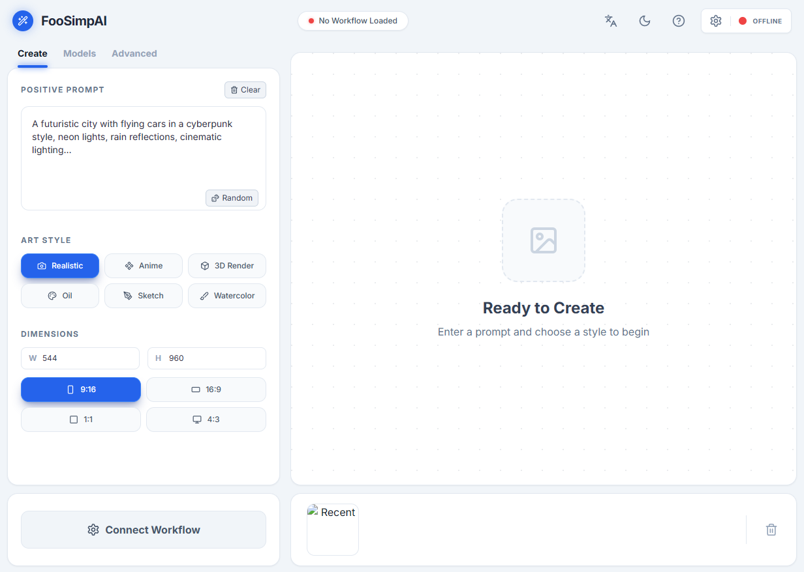

# FooSimpAI  

Next-Gen ComfyUI Frontend

FooSimpAI is a streamlined, user-friendly interface designed for ComfyUI. It bridges the gap between complex node-based workflows and simple, accessible artistic creation.

  <h3><a href="https://xhoxye.github.io/FooSimpAI/"> >> FooSimpAI v1.0.0 Demo <<</a></h3>

## Screenshots

# Run and deploy your AI Studio app

This contains everything you need to run your app locally.

## Run Locally

**Prerequisites:**  Node.js

1. Install dependencies:
   `npm install`
2. Run the app:
   `npm run dev`

## QUICK START GUIDE

1 Connect Backend   
Ensure your ComfyUI instance is running with "--listen --enable-cors-header *" CORSenabled.   

2 Load Workflow   
Upload a workflow exported in API Format (JSON) from ComfyUI.  

3 Map Parameters   
Use the settings dialog to map UI controls to specific nodes.  

4 Generate   
Close settings, type your prompt, and hit Generate!   

# FooSimpAI

下一代ComfyUI前端

FooSimpAI是一个为ComfyUI设计的简化、用户友好的界面。它弥合了复杂的基于节点的工作流与简单、易访问的艺术创作之间的差距。

  <h3><a href="https://xhoxye.github.io/FooSimpAI/"> >> FooSimpAI v1.0.0 演示 <<</a></h3>

## 屏幕截图

# 运行和部署您的AI工作室应用

这包含了在本地运行应用程序所需的一切。

## 本地运行

**先决条件：** Node.js

1. 安装依赖：
   `npm install`
2. 运行应用程序：
   `npm run dev`

## 快速入门指南

1. 连接后端   
   确保您的ComfyUI实例正在运行，并带有"--listen --enable-cors-header *"参数以启用CORS 跨域访问。

2. 加载工作流   
   上传从ComfyUI导出的API格式(JSON)工作流。

3. 映射参数   
   使用设置对话框将UI控件映射到特定节点。

4. 生成   
   关闭设置，输入提示词，然后点击生成！